# LangGraph Collectibles Analysis Workflow

## Complete System Architecture

```mermaid
graph TD
    Start(["Graph Execution Started<br/>Initialize Run ID"]) --> Init["Initialize State<br/>----------------<br/>Filename & Buffer<br/>Image Base64<br/>Metadata: null<br/>GPS: null"]
    
    Init --> ClassifyNode["classify_image Node<br/>----------------<br/>Model: GPT-4o-2024-08-06<br/>Low Detail Analysis"]
    
    ClassifyNode --> ClassifyResult["Classification Result<br/>----------------<br/>Category: collectables<br/>Confidence: 0.9<br/>Status: Success"]
    
    ClassifyResult --> ContextNode["collect_context Node<br/>----------------<br/>Check for Additional Data<br/>GPS String: null<br/>POI Cache: null"]
    
    ContextNode --> LocationNode["location_intelligence_agent<br/>----------------<br/>No GPS Data Available<br/>Skip Location Analysis<br/>Debug Usage: undefined"]
    
    LocationNode --> HandleNode["handle_collectible Node<br/>----------------<br/>Main Analysis Engine<br/>Vision + Search Integration"]
    
    HandleNode --> SearchPhase{"Dual Search Strategy"}
    
    SearchPhase --> SearchA["Google Search Query 1<br/>----------------<br/>Power Pack comic book<br/>issue 1 Marvel<br/>Fetch Time: 18:10:17"]
    
    SearchPhase --> SearchB["Google Search Query 2<br/>----------------<br/>Power Pack #1<br/>comic book value<br/>Fetch Time: 18:10:21"]
    
    SearchA --> Results1["Search Results Set 1<br/>----------------<br/>Wikipedia Info<br/>MyComicShop Listings<br/>GoCollect Values"]
    
    SearchB --> Results2["Search Results Set 2<br/>----------------<br/>GoCollect Prices<br/>ComicBookRealm Data<br/>RareComics Values"]
    
    Results1 --> Merge["Combine Search Results"]
    Results2 --> Merge
    
    Merge --> Analysis["Vision LLM Analysis<br/>----------------<br/>Extract Specifics<br/>Assess Condition<br/>Estimate Value"]
    
    Analysis --> AnalysisData["Structured Data Output<br/>----------------<br/>Category: Comic Book<br/>Publisher: Marvel<br/>Issue Number: 1<br/>Year: 1984<br/>Condition: Good Rank 3<br/>Value: $4.48 - $25 USD<br/>Confidences: 0.9/0.8/0.85"]
    
    AnalysisData --> DescribeNode["describe_collectible Node<br/>----------------<br/>Model: GPT-4o-mini<br/>Generate Rich Description"]
    
    DescribeNode --> FinalOutput["Final Result Package<br/>----------------<br/>Caption Generated<br/>Description with Sources<br/>Keywords Array<br/>Price Sources Cited<br/>Collectible Insights<br/>Search Results Used: 10"]
    
    FinalOutput --> End(["Graph Execution Finished<br/>Total Runtime: ~60s"])
    
    style Start fill:#2e7d32,stroke:#1b5e20,stroke-width:4px,color:#fff
    style End fill:#c62828,stroke:#b71c1c,stroke-width:4px,color:#fff
    style ClassifyNode fill:#1565c0,stroke:#0d47a1,stroke-width:3px,color:#fff
    style ContextNode fill:#1565c0,stroke:#0d47a1,stroke-width:3px,color:#fff
    style LocationNode fill:#1565c0,stroke:#0d47a1,stroke-width:3px,color:#fff
    style HandleNode fill:#1565c0,stroke:#0d47a1,stroke-width:3px,color:#fff
    style DescribeNode fill:#1565c0,stroke:#0d47a1,stroke-width:3px,color:#fff
    style ClassifyResult fill:#ef6c00,stroke:#e65100,stroke-width:3px,color:#fff
    style Analysis fill:#ef6c00,stroke:#e65100,stroke-width:3px,color:#fff
    style SearchPhase fill:#6a1b9a,stroke:#4a148c,stroke-width:3px,color:#fff
    style SearchA fill:#7b1fa2,stroke:#6a1b9a,stroke-width:2px,color:#fff
    style SearchB fill:#7b1fa2,stroke:#6a1b9a,stroke-width:2px,color:#fff
    style Results1 fill:#8e24aa,stroke:#6a1b9a,stroke-width:2px,color:#fff
    style Results2 fill:#8e24aa,stroke:#6a1b9a,stroke-width:2px,color:#fff
    style Merge fill:#6a1b9a,stroke:#4a148c,stroke-width:3px,color:#fff
    style AnalysisData fill:#00695c,stroke:#004d40,stroke-width:3px,color:#fff
    style FinalOutput fill:#2e7d32,stroke:#1b5e20,stroke-width:4px,color:#fff
    style Init fill:#37474f,stroke:#263238,stroke-width:2px,color:#fff
```

## Workflow Steps

1. **classify_image**: Uses GPT-4o to determine if the image contains a collectible item
2. **collect_context**: Gathers metadata and GPS information if available
3. **location_intelligence_agent**: Processes location data (skipped if unavailable)
4. **handle_collectible**: Performs dual Google searches to gather pricing and market data
5. **describe_collectible**: Generates rich descriptions with GPT-4o-mini using collected data

## Key Features

- Multi-model approach (GPT-4o for classification, GPT-4o-mini for description generation)
- Dual search strategy for comprehensive market analysis
- Confidence scoring for all extracted data
- Price sourcing from multiple collectibles marketplaces
